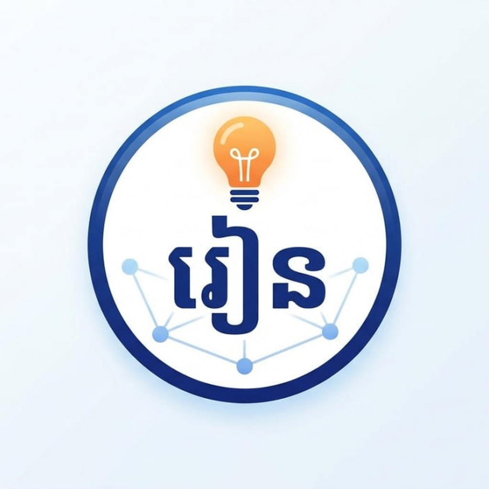
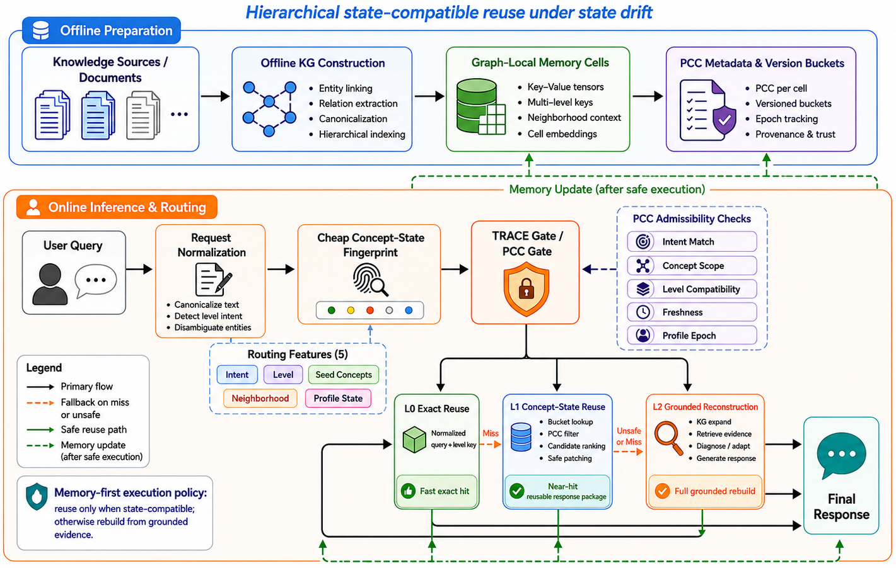

<div align="center">



# AI Tutor

### Math, Physics, and English tutoring for Cambodian high school students

**TRACECAG · Real-Time Voice · Knowledge Graph · CEFR Assessment**

---

[](https://flutter.dev)
[](https://fastapi.tiangolo.com)
[](https://www.python.org)
[](https://langchain-ai.github.io/langgraph/)
[](https://github.com/Thna17/AI-Tutor-Backend)

<br/>

> *AI Tutor builds a live knowledge graph of each student's concept gaps, diagnoses errors in real time,*
> *and generates personalized explanations for Cambodian high school Math, Physics, and English.*

<br/>

[**Quick Start**](#6-getting-started) · [**Architecture**](#2-architecture-overview) · [**API Overview**](#9-api--service-overview) · [**TRACECAG**](#10-ai--TRACECAG--knowledge-graph)

</div>

---

## 1. Project Overview

AI Tutor is a full-stack tutoring platform for Cambodian high school students built as a **monorepo with 5 deployable services**. It combines a Flutter mobile app, a FastAPI backend, a Python AI service, a React admin dashboard, and an MCP agent server.

### Target users

| User type | Description |
|-----------|-------------|
| **Learner** | Cambodian high school student using the mobile app for Math, Physics, and English lessons, AI chat, and guided practice |
| **Admin** | Content manager / super-admin using the dashboard to manage users, courses, and system config |
| **Developer / Agent** | IDE tool users and AI agents accessing the MCP server for localization and graph tooling |

### Core capabilities

- **Adaptive practice** — mastery-aware review with per-user progress tracking
- **Structured courses** — Cambodian high school Math, Physics, and English curriculum with units, lessons, and exercises
- **AI tutor (AI Tutor Chat)** — Contextual conversation powered by the TRACECAG pipeline
- **Topic-based chat** — Conversation practice across 68 topic catalogs (60 TraceCAG-generated, A1–C1, 16 categories)
- **Guided problem solving** — Socratic hints, misconception tracking, and step-by-step support
- **English voice / pronunciation** — Real-time dual-stream STT/TTS + HuBERT phoneme analysis
- **Subject diagnostics** — Multi-skill checks across Math, Physics, and English
- **Knowledge graph** — Live KuzuDB graph of learner concept mastery, updated per interaction
- **Admin dashboard** — Full CMS for courses, vocabulary, users, analytics, and AI model config
- **Progress insights** — Mastery, streaks, misconceptions, and course progress

---

## 2. Architecture Overview

The system is organized into 8 architectural layers:

| Layer | Role | Primary tech |
|-------|------|-------------|
| **Flutter Mobile App** | Cross-platform learner UI (iOS / Android / Web) | Dart 3.8, Flutter 3.24, Provider, GetIt |
| **Backend API Service** | REST API, auth, data persistence, business logic | Python 3.11, FastAPI, SQLAlchemy 2 async, PostgreSQL, Redis |
| **AI Service** | LLM orchestration, knowledge graph, voice pipeline | Python 3.11, FastAPI, LangGraph, KuzuDB, Faster-Whisper, Piper, HuBERT |
| **Admin Dashboard** | Content management and monitoring SPA | TypeScript, React 18, Vite, Zustand, Recharts |
| **MCP Agent Server** | IDE integration tools via Model Context Protocol | Python, MCP SDK, stdio transport |
| **Infrastructure & Deployment** | Container orchestration, API gateway, observability | Docker Compose, Kong Gateway, PostgreSQL, Redis, MongoDB |
| **CI/CD Pipelines** | Automated test, build, deploy, i18n sync | GitHub Actions |
| **Documentation** | Architecture docs, feature plans, i18n guides | Markdown |

### System diagram


### Why TRACECAG over RAG?

| | Traditional RAG | AI Tutor TRACECAG |
|-|----------------|--------------------|
| **Context source** | Static document chunks | Live KuzuDB knowledge graph + Redis learner cache |
| **Personalization** | None — same docs for everyone | Per-user mastery scores, error history, CEFR level |
| **Retrieval latency** | Vector search on every turn | Pre-cached learner profile + graph BFS |
| **Curriculum awareness** | Zero | Prerequisite chains: "Past Simple → Past Perfect → Reported Speech" |
| **Error diagnosis** | Not possible | Dedicated Diagnose node maps errors to KG concept IDs |

---

## 3. Key Features

| Feature | Description | Main layer |
|---------|-------------|-----------|
| TRACECAG AI Tutor | Responses grounded in learner's live knowledge graph via TraceCag pipeline | AI Service |
| Math and Physics Support | Step-by-step problem solving, hint ladders, scratchpad flows, and misconception tracking | AI Service + Mobile |
| English Support | Conversation, pronunciation, grammar, and reading practice for high school learners | AI Service + Backend |
| Voice Pronunciation | Dual-stream WebSocket: simultaneous STT (Whisper) + TTS (Piper) + HuBERT phoneme scoring | AI Service |
| Structured Curriculum | Subject-based curriculum with units, lessons, diagnostics, and progress tracking | Backend + Mobile |
| Topic Chat | AI conversations and guided tutoring across school subjects | AI Service |
| Progress Insights | Mastery, streaks, achievements, weak topics, and learning history | Backend + Mobile |
| Admin CMS | Course, subject, user, analytics, and AI model management | Admin Dashboard |
| MCP IDE Tools | i18n key manager, local model handlers for developer workflow | MCP Server |
| Multi-language UI | Khmer-first student experience with English support and room for additional locales | Mobile |
| Offline Support | sqflite local cache for vocabulary and progress | Mobile |

---

## 4. Tech Stack

| Area | Technology |
|------|-----------|
| **Mobile** | Flutter 3.24+, Dart 3.8, Provider, GetIt, sqflite, Dio/http |
| **Frontend (Admin)** | React 18, TypeScript 6, Vite, Zustand 5, Recharts, TanStack Query 5 |
| **Backend** | Python 3.11, FastAPI 0.136+, SQLAlchemy 2 async, Alembic, Pydantic v2 |
| **AI Orchestration** | LangGraph 1.2+, LangChain Core |
| **LLM (Local)** | Qwen3-1.7B(4-bit), LLaMA3-VI 3B (lazy-loaded), Ollama (qwen3 1.7b) |
| **LLM (Cloud)** | Google Gemini 2.5 Flash (primary cloud fallback), Groq (qwen3-32b) |
| **Voice STT** | Faster-Whisper (base–small, int8, CUDA) |
| **Voice TTS** | Piper TTS (en_US-lessac-medium.onnx) |
| **Pronunciation** | HuBERT-large-ls960-ft (Facebook), sentence-transformers |
| **Knowledge Graph** | KuzuDB 0.11+ (embedded graph DB) |
| **Vector Embeddings** | all-MiniLM-L6-v2 (sentence-transformers) |
| **Primary DB** | PostgreSQL 14+ (asyncpg) |
| **Cache / Sessions** | Redis 7 |
| **AI Logs / History** | MongoDB (Motor async driver) |
| **Auth** | JWT (RS256, python-jose), Firebase Admin SDK, Google OAuth 2.0 |
| **API Gateway** | Kong (rate limiting, auth, routing) |
| **Container** | Docker Compose (production multi-service stack) |
| **CI/CD** | GitHub Actions (ci.yml, cd.yml, crowdin-sync.yml) |
| **i18n** | Crowdin (synced via GitHub Action) |
| **MCP** | Model Context Protocol Python SDK (stdio transport) |

---


## 5. Getting Started

### Prerequisites

| Tool | Version |
|------|---------|
| Python | 3.11+ |
| Flutter | 3.24+ |
| Node.js | 18+ (for admin dashboard) |
| PostgreSQL | 14+ |
| Redis | 7+ |
| Docker & Docker Compose | Latest (optional but recommended) |

### Option A — Docker (recommended)

```bash
git clone https://github.com/Thna17/AI-Tutor-Backend.git
cd AI-Tutor-Backend
cp backend-service/.env.example backend-service/.env
cp ai-service/.env.example ai-service/.env
cp .env.example .env
docker compose -f docker-compose.dev.yml up -d
```

### Option B — All services locally (no Docker)

```bash
bash scripts/start-all.sh
```

This script starts the backend, AI service, and Flutter web in the background, writing logs to `logs/`.

### Manual setup per service

#### Backend API

```bash
cd backend-service
python -m venv venv && source venv/bin/activate
pip install -r requirements.txt
cp .env.example .env # fill DATABASE_URL, SECRET_KEY, etc.

createdb ai_tutor
alembic upgrade head # run DB migrations

uvicorn app.main:app --reload --port 8000
```

#### AI Service

```bash
cd ai-service
bash setup.sh # creates venv, installs deps, copies .env
source venv/bin/activate
# fill .env: GEMINI_API_KEY, KUZU_DB_PATH, REDIS_URL, etc.
uvicorn api.main:app --reload --port 8001
```

#### Flutter Mobile App

```bash
cd flutter-app
flutter pub get
cp .env.example assets/env/.env # set API_BASE_URL

flutter run # default device
make run-web # Chrome
make run-ios # iOS simulator
make run-android # Android emulator/device
```

#### Admin Dashboard

```bash
cd admin-service
pnpm install
cp .env.example .env # set VITE_BACKEND_URL, VITE_AI_URL
pnpm dev # dev server at http://localhost:5173
```

---

## 6. Environment Variables

Copy `.env.example` in each service directory and fill in the required values.

| Service | Key variables |
|---------|--------------|
| `backend-service` | `DATABASE_URL`, `SECRET_KEY`, `REDIS_URL`, `ALLOWED_ORIGINS` |
| `ai-service` | `GEMINI_API_KEY`, `KUZU_DB_PATH`, `REDIS_URL`, `MONGODB_URI`, `BACKEND_SERVICE_URL` |
| `admin-service` | `VITE_BACKEND_URL`, `VITE_AI_URL` |

---

## 7. Scripts

```bash
# Start / stop all services locally
bash scripts/start-all.sh
bash scripts/stop-all.sh

# Docker
docker-compose up -d
docker-compose down

# Flutter (via Makefile)
make run-web       # Chrome
make run-ios       # iOS simulator
make build-apk     # Android release

# Backend
alembic upgrade head   # run migrations
pytest tests/          # run tests
```

---

## 8. API Overview

All requests route through **Kong Gateway** (`:80`/`:443` in production). Interactive OpenAPI docs at `http://localhost:8000/docs` (backend) and `http://localhost:8001/docs` (AI service).

**Backend `/api/v1/`** — auth, users, courses, learning, progress, misconceptions, tutor catalog, admin, analytics, and monitoring

**AI Service `/api/v1/`** — ai tutor chat (TraceCag), topic chat, STT/pronunciation, TTS, WebSocket dual-stream (`/ws/stream`), AI analytics, admin config

---

## 9. TRACECAG / Knowledge Graph

The AI tutor uses a **LangGraph StateGraph** (`ai-service/api/services/trace_cag/`) with 4 nodes: **Diagnose → Retrieve → Ground → Generate**. Each response is grounded in the learner's live KuzuDB concept graph rather than static documents. See [docs/ARCHITECTURE.md](docs/ARCHITECTURE.md) for a detailed pipeline diagram.

### TRACE-CAG Architecture



TRACE-CAG runs as a **hierarchical, memory-first pipeline** with three reuse tiers:

| Tier | Mechanism | When triggered |
|------|-----------|----------------|
| **L0 Exact Reuse** | Normalized query + level key lookup | Identical query seen before |
| **L1 Concept-State Reuse** | Bucket lookup → PCC filter → candidate ranking | Near-hit on concept fingerprint |
| **L2 Grounded Reconstruction** | KG expand → retrieve evidence → diagnose → generate | Cache miss or unsafe reuse |

Online routing extracts 5 features per query — Intent, Level, Seed Concepts, Neighborhood, Profile State — and passes them through the **TRACE Gate / PCC Gate** for admissibility checks (intent match, concept scope, level compatibility, freshness, profile epoch) before selecting the reuse tier.

Key locations:
- Runtime graph DB: `ai-service/data/kuzu_db/`
- Seed concepts: `ai-service/data/kg/*.json` (incl. `06_tracecag_topic_expansion.json` — 4,040 nodes)
- KG synthesis: `ai-service/scripts/build_kg.py --force`
- Pipeline source: `ai-service/api/services/trace_cag/`
- Codebase architecture graph: `.understand-anything/knowledge-graph.json`

---

## 10. Project Ownership

This repository is maintained as AI Tutor by [Thna17](https://github.com/Thna17).

---

<div align="center">

[Architecture Docs](docs/ARCHITECTURE.md) · [Report Issue](https://github.com/Thna17/AI-Tutor-Backend/issues) · [Discussions](https://github.com/Thna17/AI-Tutor-Backend/discussions)

Built by [Thna17](https://github.com/Thna17)

</div>
