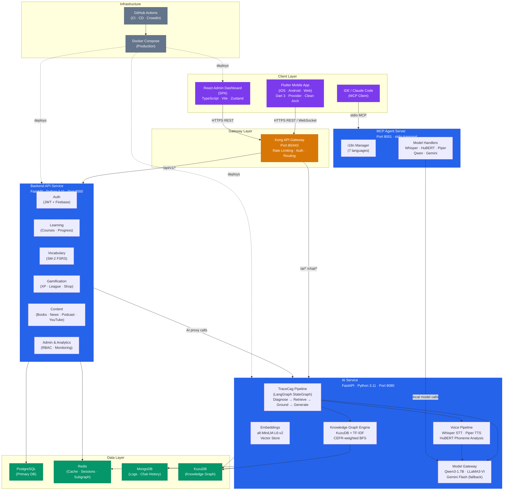

# LexiLingo — Architecture Overview

> **Version**: 2.0 | **Updated**: 2026-06-01 
> Generated from knowledge graph: 1,844 nodes · 2,174 edges · 1,133 source files

---

## 1. Tổng quan hệ thống

LexiLingo là ứng dụng học tiếng Anh AI-first với kiến trúc **monorepo 5 service**, kết hợp:

- **TRACECAG** — Graph-Context Augmented Generation: ground câu trả lời AI vào live knowledge graph của người học (thay vì RAG trên static documents)
- **TraceCag Pipeline** — LangGraph StateGraph: Diagnose → Retrieve → Ground → Generate
- **CEFR Adaptive Curriculum** — Nội dung tự điều chỉnh A1→C2
- **Real-time Voice** — Dual-stream STT/TTS đồng thời qua WebSocket
- **Spaced Repetition** — SuperMemo SM-2 / FSRS cho vocabulary

---

## 2. Sơ đồ kiến trúc hệ thống



---

## 3. Module chi tiết

### 3.1 Flutter Mobile App

| Thuộc tính | Chi tiết |
|---|---|
| **Platform** | iOS · Android · Web (Flutter 3.24+) |
| **State Management** | Provider + GetIt (DI) |
| **Architecture** | Clean Architecture — features/[domain]/{data,domain,presentation} |
| **Offline** | sqflite local cache |
| **i18n** | 7 ngôn ngữ (en, vi, zh, ja, ko, es, fr) |

**Feature modules (21 modules):**

```
flutter-app/lib/features/
├── auth/ — Đăng nhập, Google Sign-In, Firebase Auth
├── learning/ — Lộ trình học Duolingo-style (zigzag roadmap, bezier path)
├── vocabulary/ — Thẻ từ vựng + SM-2/FSRS spaced repetition
├── lexi_chat/ — Chat AI với TraceCag (streaming)
├── chat/ — Topic-based conversations
├── voice/ — Luyện phát âm (HuBERT phoneme feedback)
├── course/ — Danh mục khoá học CEFR A1→C2
├── progress/ — Thống kê học tập, streak, heatmap
├── gamification/ — XP, achievements, league, shop, leaderboard
├── games/ — Mini-games từ vựng
├── achievements/ — Badge system
├── level/ — CEFR level tracking
├── social/ — Friend system
├── profile/ — User profile & settings
├── books/ — Graded readers
├── news/ — BBC/CNN learning articles
├── podcast/ — English podcasts
├── youtube/ — YouTube learning content
├── home/ — Dashboard chính
├── notifications/ — Push notifications (FCM)
└── user/ — Account management
```

**Luồng dữ liệu:**
```
UI Widget → Provider (ChangeNotifier) → UseCase → Repository
→ RemoteDataSource (HTTP/WS) → Kong Gateway → Backend/AI
→ LocalDataSource (sqflite) ← cache
```

---

### 3.2 Backend API Service

| Thuộc tính | Chi tiết |
|---|---|
| **Framework** | FastAPI + Uvicorn |
| **ORM** | SQLAlchemy 2.0 async |
| **DB** | PostgreSQL (primary), Redis (cache/sessions) |
| **Auth** | JWT (RS256) + Firebase Admin SDK |
| **Migrations** | Alembic |
| **Port** | 8000 (internal), exposed qua Kong |

**24 route groups:**

```
/api/v1/
├── auth/ — Register, login, refresh, Firebase exchange, OAuth
├── users/ — Profile CRUD, avatar, preferences
├── courses/ — Course/unit/lesson catalog (CEFR-tagged)
├── categories/ — Course categories
├── vocabulary/ — Word bank, SM-2 review scheduling
├── learning/ — Session tracking, lesson completion
├── progress/ — Streak, XP, enrollment, roadmap
├── gamification/ — Achievements, wallet, leaderboard, shop, social
├── challenges/ — Weekly challenges
├── games/ — Game sessions (word guess, flash cards...)
├── xp/ — XP transactions, level-up
├── proficiency/ — CEFR multi-skill assessment
├── admin/ — Content management (CRUD courses/vocab/grammar)
├── user-management/ — Admin: bulk user ops, ban, reset
├── rbac/ — Role & permission management
├── analytics/ — DAU/MAU, retention, engagement metrics
├── monitoring/ — Service health, AI model status
├── books/ — Graded reader catalog
├── news/ — Article feed (BBC Learning English)
├── podcasts/ — Podcast episodes
├── youtube/ — YouTube clip metadata
├── ai-audit/ — AI request/response logging
├── devices/ — Device registration (push notifications)
└── health/ — Liveness/readiness probe
```

**Core infrastructure:**
```
app/core/
├── config.py — Settings singleton (Pydantic BaseSettings, .env)
├── database.py — Async SQLAlchemy engine + session factory
├── security.py — bcrypt hash, JWT create/decode, Google OAuth verify
├── firebase_auth.py— Firebase Admin token verification
├── dependencies.py — FastAPI Depends factories (auth guards, RBAC)
├── middleware.py — PNA → CORS → RateLimit → RequestID → Logging
├── redis.py — Redis singleton
└── cache.py — Redis/memory dual-layer cache
```

---

### 3.3 AI Service

| Thuộc tính | Chi tiết |
|---|---|
| **Framework** | FastAPI + Uvicorn |
| **AI Orchestration** | LangGraph (StateGraph) |
| **Graph DB** | KuzuDB (knowledge graph) |
| **Vector Search** | FAISS / sentence-transformers |
| **Voice STT** | Faster-Whisper v3 (small, 244MB) |
| **Voice TTS** | Piper (en_US-lessac-medium) |
| **Pronunciation** | HuBERT-large-ls960-ft (Facebook) |
| **LLM** | Qwen3-1.7B (primary) → Gemini Flash (fallback) |
| **Vietnamese** | LLaMA3-VI 3B (lazy-loaded) |
| **Port** | 8080 (internal) |

**TraceCag Pipeline (trái tim của TRACECAG):**

```
User Input
 │
 ▼
┌─────────────────────────────────────────────────────┐
│ TraceCag LangGraph StateGraph │
│ │
│ ┌──────────┐ ┌──────────┐ ┌──────────────────┐ │
│ │ DIAGNOSE │──▶│ RETRIEVE │──▶│ GROUND │ │
│ │ │ │ │ │ │ │
│ │ Error │ │ KG BFS │ │ Merge KG context │ │
│ │ classify │ │ +Vector │ │ + learner profile│ │
│ │ CEFR map │ │ +Redis │ │ into prompt │ │
│ └──────────┘ └──────────┘ └──────────────────┘ │
│ │ │
│ ┌─────────▼──────────┐ │
│ │ GENERATE │ │
│ │ Qwen2.5 / Gemini │ │
│ │ Streaming SSE │ │
│ └────────────────────┘ │
└─────────────────────────────────────────────────────┘
 │
 ▼
Response grounded in learner's personal knowledge graph
```

**Knowledge Graph (KuzuDB):**
```
KuzuDB schema:
 Nodes: Concept (CEFR level, mastery score, error history)
 Edges: prerequisite_of, related_to, confused_with

Retrieval pipeline:
 1. TF-IDF inverted index → seed concept candidates
 2. CEFR-weighted BFS → expand prerequisite graph
 3. Redis L0 subgraph hot-cache → sub-10ms hits
 4. all-MiniLM-L6-v2 embeddings → semantic re-rank
```

**Voice Pipeline:**
```
Speaking Practice:
 Microphone → WebSocket → dual_stream_orchestrator
 ├── STT: Faster-Whisper → transcript
 ├── TTS: Piper → audio response
 └── Pronunciation: HuBERT → phoneme analysis
 → Vietnamese error patterns (e.g. /θ/, /ð/, tones)
 → IPA comparison + feedback score
```

**Route groups:**
```
/api/v1/
├── chat/ — General conversation (TraceCag powered)
├── lexi/ — Lexi AI tutor (full session management)
├── stt/ — Speech-to-text + pronunciation scoring
├── tts/ — Text-to-speech synthesis
├── topics/ — Topic-based conversation catalog
├── ai/ — AI analytics, model health
├── admin/ — AI model management
└── /ws/stream — WebSocket dual-stream endpoint
```

---

### 3.4 React Admin Dashboard

| Thuộc tính | Chi tiết |
|---|---|
| **Framework** | React 18 + TypeScript + Vite |
| **State** | Zustand |
| **Charts** | Recharts |
| **Auth** | JWT (same Backend API) + RBAC roles |
| **Deploy** | Vercel / Netlify |
| **i18n** | Vietnamese + English |

**Pages (18 pages):**

```
admin-service/src/pages/
├── LoginPage — Auth với backend JWT
├── AdminDashboard — Overview widgets
├── EnhancedAdminDashboard — Super admin view
├── SuperAdminDashboard — Cross-service metrics
├── UserManagementPage — User list, filter, ban, reset
├── CoursesPage — Course CRUD + import modal
├── UnitsPage / LessonsPage— Curriculum management
├── VocabularyPage — Word bank management
├── AchievementsPage — Badge/achievement management
├── ShopPage — In-app shop items
├── MonitoringPage — Service health, AI model status
├── AiModelsPage — LLM model configuration
├── AiChatSettingsPage — TraceCag prompt config
├── ContentAnalyticsPage — Content engagement metrics
├── ContentLabPage — AI content generation
├── DatabasePage — DB health, query stats
├── LogsPage — System logs viewer
├── SystemSettingsPage — Global config (rate limits, flags)
└── AdminManagementPage — Sub-admin role assignment
```

---

### 3.5 MCP Agent Server

| Thuộc tính | Chi tiết |
|---|---|
| **Protocol** | Model Context Protocol (MCP) 1.0 |
| **Transport** | stdio (IDE integration) |
| **Port** | 8001 (HTTP mode) |
| **Use case** | AI agent tools cho developers / Claude Code |

**Available tools:**

```
MCP Tools:
├── manage_i18n_key — Thêm/cập nhật localization key trong 7 file JSON
├── whisper_handler — Chạy Whisper STT locally
├── hubert_handler — Phoneme analysis locally
├── piper_handler — TTS synthesis locally
├── qwen_handler — Qwen2.5 inference locally (4-bit quantized)
├── gemini_handler — Gemini API calls
└── ollama_qwen_handler— Ollama-served Qwen inference
```

**Use cases:**
- Developer gọi `manage_i18n_key` để sync localization keys qua Claude Code
- AI agent kiểm tra phát âm / sinh lời thoại trong IDE
- Automated content generation pipeline

---

## 4. Data flow chính

### 4.1 Học từ vựng (Spaced Repetition)

```
[Mobile] User reviews word
 │
 ▼
[Kong] → [Backend /api/v1/vocabulary/review]
 │
 ▼
[Backend] Calculate SM-2 interval
 │ UPDATE vocabulary_item (next_review, ease_factor, interval)
 ▼
[PostgreSQL] Persist review result
 │
 ▼
[Backend] Return next word in queue → [Mobile] Show next card
```

### 4.2 AI Chat với TRACECAG

```
[Mobile] User sends message
 │
 ▼
[Kong] → [AI Service /api/v1/lexi/chat (WebSocket SSE)]
 │
 ▼
[TraceCag Pipeline]
 ├── Diagnose: classify error type, map to CEFR concept
 ├── Retrieve: KuzuDB BFS + Redis L0 cache + vector search
 ├── Ground: inject KG context + learner mastery into prompt
 └── Generate: Qwen2.5 streaming → SSE → WebSocket → Mobile
 │
 ▼
[AI Service] Log session to MongoDB
[AI Service] Update KG mastery scores → KuzuDB
```

### 4.3 Speaking Practice

```
[Mobile] User speaks → audio chunks via WebSocket
 │
 ▼
[AI Service /ws/stream — dual_stream_orchestrator]
 ├── Whisper STT: audio → transcript (real-time)
 ├── HuBERT: audio → phoneme sequence → error detection
 │ └── Vietnamese patterns: /θ/→/t/, /ð/→/d/, tone mapping
 └── Piper TTS: response text → audio (streamed back)
 │
 ▼
[Mobile] Shows transcript + phoneme heatmap + IPA correction
```

---

## 5. Infrastructure & Deployment

```
Production Stack (docker-compose.production.yml):
┌─────────────────────────────────────────────────┐
│ Kong Gateway :80/:443 │
│ │ │
│ ├── backend-service (FastAPI) │
│ │ └── PostgreSQL (primary DB) │
│ │ └── Redis (cache/sessions) │
│ │ │
│ └── ai-service (FastAPI) │
│ └── MongoDB (logs/history) │
│ └── KuzuDB (knowledge graph) │
│ └── Redis (subgraph cache) │
│ │
│ Admin Dashboard (Vercel/Netlify) │
│ Flutter Web (Vercel) │
└─────────────────────────────────────────────────┘

CI/CD (.github/workflows/):
├── ci.yml — Test on every PR (pytest + flutter test)
├── cd.yml — Deploy on merge to main
├── crowdin-sync.yml — Sync i18n strings với Crowdin
├── pr-agent.yml — AI code review on PRs
└── dependabot-auto-merge.yml — Auto-merge dependency updates
```

---

## 6. Dependency matrix

| | Mobile | Backend | AI Service | Admin | MCP |
|---|:---:|:---:|:---:|:---:|:---:|
| **Kong Gateway** | ← | ← | ← | ← | — |
| **PostgreSQL** | — | Y | — | — | — |
| **Redis** | — | Y | Y | — | Y |
| **MongoDB** | — | — | Y | — | Y |
| **KuzuDB** | — | — | Y | — | Y |
| **Firebase** | Y | Y | — | — | — |
| **AI Service** | via Kong | proxy | — | via Kong | direct |

---

## 7. Key technical decisions

| Decision | Rationale |
|---|---|
| **TRACECAG over RAG** | RAG retrieves from static docs; TRACECAG grounds on live learner mastery state — personalized per user per session |
| **KuzuDB for knowledge graph** | Embedded graph DB (no separate server), optimized for BFS traversal, CEFR prerequisite chains |
| **LangGraph StateGraph** | Explicit node routing (Diagnose→Retrieve→Ground→Generate) với conditional edges cho error recovery |
| **Dual-stream WebSocket** | STT và TTS chạy song song — giảm perceived latency xuống < 500ms cho speaking practice |
| **SM-2 / FSRS spaced repetition** | Proven algorithm với EF per-user — vocabulary retention tối ưu hoá theo từng người |
| **Provider (không Riverpod/Bloc)** | Simpler learning curve cho contributor, đủ mạnh cho scale hiện tại |
| **Monorepo** | 5 services trong 1 repo — dễ atomic commits, shared CI/CD, cross-service refactor |
| **Kong Gateway** | Centralized rate limiting + auth offload — backend không cần handle DDoS logic |
| **MCP Server** | AI agents (Claude Code) có thể gọi trực tiếp voice models và i18n tools trong IDE |
