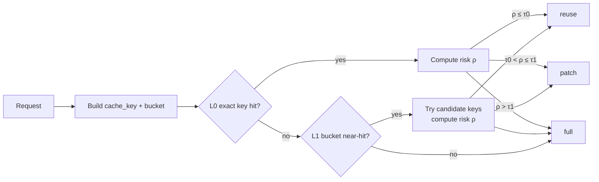

# TRACECAG + KG + Redis KV Cache (giải thích dễ hiểu)

Tài liệu này giải thích:
- **KG (Knowledge Graph)** được biểu diễn thế nào (node/edge/triples)
- **Redis KV cache** lưu cái gì trong TRACECAG
- “**Đẩy KG vào cache**” nghĩa đúng là gì (và không phải là gì)
- Pipeline TRACECAG của LexiLingo chạy ra sao và cache hit/miss hoạt động thế nào

> Ghi chú quan trọng: “KV cache” trong tài liệu này là **Key–Value cache trong Redis** (application cache), **không phải** “KV cache” (attention cache) bên trong LLM.

---

## 1) TL;DR (tóm tắt 60 giây)

- KG thường nằm trong **graph database** (ở LexiLingo là KuzuDB), không phải Redis.
- Redis dùng để cache **kết quả trung gian**: response đã tạo, “packed context”/evidence, danh sách ứng viên theo bucket.
- “Đẩy KG vào cache” thực tế là: **cache subgraph đã được chọn + đã được nén/pack** (hoặc cache kết quả expand), để request sau dùng lại nhanh.

---

## 2) TRACECAG là gì (cách hiểu đơn giản)

Bạn có 2 thứ:

- **KG (Knowledge Graph)**: giống như “bản đồ kiến thức” (khái niệm ngữ pháp/từ vựng, và quan hệ giữa chúng).
- **CAG (Cache-Augmented Generation)**: trước khi chạy pipeline tốn kém, thử xem có thể **tái sử dụng** kết quả cũ không.

**TRACECAG** = pipeline dạng **graph** (nhiều bước nối với nhau) + có **cửa kiểm tra cache** ở đầu (cache gate). Nếu cache hit, bạn trả lời nhanh; nếu miss, bạn đi qua KG expand → diagnose → retrieve → generate.

---

## 3) Pipeline minh hoạ (đúng theo LexiLingo)

### 3.1 Sơ đồ tổng quan

```mermaid
flowchart TD
  U[User Input] --> IN[input_node\n- load learner profile (Redis)\n- load conversation history (Redis)]

  IN --> CG[cache_gate_node\nRAPID risk-aware cache gate]
  CG -->|cache_hit (reuse/patch)| END[(END)]
  CG -->|cache_miss| KGD[kg_diagnose_node\n- kg_expand + diagnose (concurrent)]

  KGD -->|confidence low| CLAR[ask_clarify_node] --> END
  KGD -->|A1/A2 + errors| VI[vietnamese_node] --> RET[retrieve_node]
  KGD -->|normal| RET[retrieve_node]

  RET --> GEN[generate_node] --> END
```

### 3.2 Cache gate làm gì?

Cache gate sẽ quyết định 1 trong 3 đường:
- **reuse**: dùng lại response cũ (rủi ro thấp)
- **patch**: dùng response cũ nhưng “vá nhẹ” (ví dụ đổi level, thêm concept liên quan)
- **full**: chạy full pipeline



---

## 4) KG (Knowledge Graph) biểu diễn như thế nào?

### 4.1 Cách biểu diễn “dễ nhất”: triples (subject, relation, object)

Ví dụ bạn có concept về ngữ pháp:

- `concept:grammar.past_simple` (Past Simple)
- `concept:grammar.past_time_markers` (Past time markers)

Ta có thể biểu diễn cạnh (edge) kiểu:

```text
(concept:grammar.past_simple) -[prerequisite_of]-> (concept:grammar.past_perfect)
(concept:grammar.past_time_markers) -[related_to]-> (concept:grammar.past_simple)
```

Ưu điểm: rất dễ “pack” thành text, rất hợp để đưa vào prompt.

### 4.2 Cách biểu diễn dạng adjacency list (danh sách kề)

```json
{
  "concept:grammar.past_simple": [
    {"relation": "related_to", "to": "concept:grammar.past_time_markers"},
    {"relation": "prerequisite_of", "to": "concept:grammar.past_perfect"}
  ]
}
```

Ưu điểm: dễ lưu JSON, dễ cache theo node.

### 4.3 Cách biểu diễn “theo code LexiLingo”

Trong pipeline, KG expansion thường được đưa vào state dưới dạng list node/edge “đã mở rộng” (ví dụ `kg_expanded_nodes`, `kg_paths`). Khi cần đưa vào prompt, bạn sẽ “pack” (nén) thành một đoạn text ngắn.

---

## 5) Redis KV cache trong TRACECAG: lưu cái gì?

Trong LexiLingo hiện có vài nhóm cache:

### 5.1 Learner profile cache (cá nhân hoá)

Ví dụ key:
- `learner:{user_id}:level`
- `learner:{user_id}:errors` (list)
- `learner:{user_id}:sessions` (list)

Mục tiêu: request sau biết người học đang ở level nào, hay mắc lỗi gì.

### 5.2 Conversation history cache (lịch sử ngắn)

Key:
- `conversation:{session_id}:history` (list, sliding window)

Mục tiêu: TRACECAG biết vài lượt chat gần đây.

### 5.3 Response cache cho TRACECAG (cốt lõi của CAG)

TRACECAG đang dùng 2 lớp chính:

#### L0: exact-key cache (hit nhanh nhất)

- Tạo `cache_key = md5(normalized_input || level)`
- Redis key lưu entry:
  - `v1:resp:{cache_key}` → JSON `CacheEntry`

#### L1: bucket near-hit cache (gần giống, tìm theo bucket)

- Tạo `bucket = md5(level | turn_bucket | lightweight_concepts...)`
- Redis key lưu danh sách candidate keys:
  - `v1:resp_bucket:{bucket}` → JSON list `[cache_key1, cache_key2, ...]`

> Ý tưởng: L1 giúp tìm “cái gần giống” khi L0 không có exact match.

### 5.4 CacheEntry là gì? (value format)

Trong TRACECAG, một entry có thể hiểu đơn giản là:

```json
{
  "fingerprint": {
    "query_norm": "...",
    "intent": "correct|explain|practice|unknown",
    "level": "A2|B1|...",
    "root_concepts": ["concept:..."],
    "session_turn": 3
  },
  "graph_bucket": "<bucket>",
  "profile_snapshot": {"level": "B1", "common_errors": ["..."]},
  "response": "<tutor_response_text>",
  "evidence_bundle": [
    {"type": "kg", "content": "(past_simple)-[related_to]->(past_time_markers)"}
  ],
  "execution_plan": {"strategy": "feedback", "intent": "correct"},
  "diagnosis_errors": [{"span": "...", "type": "...", "correction": "..."}],
  "overall_score": 0.82,
  "created_at": 123456.7,
  "ttl": 3600
}
```

---

## 6) “Đẩy KG vô cache” nghĩa đúng là gì?

### 6.1 Nghĩa SAI (thường bị hiểu nhầm)

- ❌ “Cho toàn bộ KG (database) vào Redis” để LLM đọc trực tiếp.
  - Không hợp lý: KG là dữ liệu có cấu trúc + cần query theo quan hệ; Redis KV không phải graph DB.

### 6.2 Nghĩa ĐÚNG (khuyến nghị)

- ✅ Cache **kết quả query/expand** của KG (subgraph nhỏ liên quan đến request)
- ✅ Cache **packed-context** (subgraph đã được “nén” thành text) để đưa vào prompt nhanh

Nói ngắn gọn: Redis cache nên lưu **đầu ra của KG**, không lưu “toàn bộ KG”.

---

## 7) Ví dụ minh hoạ end-to-end

Giả sử user nhập:

> “Yesterday I go to school. Fix my sentence.”

### 7.1 Tạo cache_key (L0)

- `normalized_input = "yesterday i go to school. fix my sentence."`
- `level = "B1"` (lấy từ learner profile)
- `cache_key = md5("<normalized_input>||B1")`

Redis lookup:
- `GET v1:resp:{cache_key}`
  - Nếu có → tính rủi ro ρ → reuse/patch
  - Nếu không → sang L1

### 7.2 Tạo bucket (L1)

Bucket dùng “lightweight concepts” (pattern-based) để nhóm câu tương tự. Ví dụ câu có `yesterday` có thể map nhẹ tới:
- `concept:grammar.past_time_markers`

Redis lookup:
- `GET v1:resp_bucket:{bucket}` → danh sách vài `cache_key` ứng viên
- Lấy từng ứng viên → `GET v1:resp:{candidate_key}` → tính rủi ro ρ → reuse/patch/full

### 7.3 Nếu miss → chạy full pipeline

- `kg_expand` chọn các concept liên quan (ví dụ past simple / time markers)
- `diagnose` phát hiện lỗi gốc (root cause)
- `retrieve` lấy ví dụ/sửa lỗi
- `generate` tạo tutor response
- `write-back` cache:
  - `SET v1:resp:{cache_key} <CacheEntry> EX <ttl>`
  - `SET v1:resp_bucket:{bucket} [cache_keys...] EX <ttl>`

---

## 8) Pack KG: làm sao để “gọn mà vẫn đủ dùng”?

Mục tiêu của “pack” là biến subgraph thành **một đoạn text nhỏ** (ít token) nhưng vẫn đủ thông tin.

Gợi ý format pack (rất dễ đọc):

```text
[KG]
- Past time markers: yesterday/last/ago → usually needs Past Simple
- Common fix pattern: yesterday + base verb → yesterday + V2
- Example: "Yesterday I went to school." (go→went)
```

Vì sao pack quan trọng?
- LLM chỉ “thấy” những gì bạn đưa vào context.
- KG có thể nhiều cạnh; pack giúp chọn đúng phần liên quan.

---

## 9) TTL / versioning / invalidation (tại sao cần?)

Cache không phải “mãi mãi đúng”. Khi dữ liệu/logic thay đổi, cache có thể sai.

Trong TRACECAG có 2 kiểu “hết hạn”:

- **TTL**: entry tự hết hạn sau N giây (ví dụ 1800–3600s)
- **Versioning** (đặc biệt cho L1 bucket): khi bạn đổi schema KG hoặc đổi prompt/policy, bucket nên bị invalidate.

Trong code có các version constant kiểu:
- `nu_graph` (đổi khi KG topology/schema thay đổi)
- `nu_policy` (đổi khi chiến lược/prompt template thay đổi)

---

## 10) Checklist nhanh (thực chiến)

- Bạn cần cache gì?
  - Response (L0/L1) như hiện tại
  - KG expand result theo concept
  - Packed-context theo concept/topic
- Key design:
  - có `v1:` prefix (để bump version dễ)
  - include `level`, `intent` hoặc `bucket`
- TTL:
  - response cache: ngắn (phút/giờ)
  - concept pack cache: dài hơn (ngày)
- Tránh cache “answer” quá cá nhân hoá lâu dài (privacy + drift)

---

## 11) Liên hệ với code LexiLingo (để tra cứu)

- TRACECAG pipeline: `ai-service/api/services/graph_cag/graph.py`
- Cache gate + Redis keys (`v1:resp:*`, `v1:resp_bucket:*`): `ai-service/api/services/graph_cag/nodes_v2.py`
- State schema (CacheEntry/Fingerprint): `ai-service/api/services/graph_cag/state.py`
- Redis client (learner/conversation caches): `ai-service/api/core/redis_client.py`
- KG service (KuzuDB): `ai-service/api/services/kg_service_v3.py`

---

## 12) Nếu bạn muốn nâng cấp “đẩy KG vào cache” thêm một bước

Hiện tại TRACECAG đang cache chủ yếu “response + evidence text”. Nếu bạn muốn cache KG tốt hơn (KG nhỏ càng hiệu quả):

- Cache theo concept:
  - `kg:expand:v1:{concept_id}:{depth}` → JSON subgraph
  - `kg:pack:v1:{concept_id}:{lang}` → packed text
- Khi chạy pipeline:
  - lấy root concepts → GET pack nhanh → ghép vào `retrieved_context`

(Phần này là gợi ý thiết kế; nếu bạn muốn, mình có thể viết thêm module cache riêng hoặc tích hợp vào `kg_expand_node`.)
