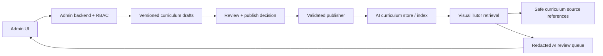

# Admin, Backend, and AI Tutor integration baseline

## Current flow

### Admin authentication

The Admin frontend calls the Node backend directly. It stores access and refresh
tokens in browser local storage, then sends the access token as a Bearer token.
The backend authenticates the token and enforces an admin role before serving
Admin routes. This works for local development, but production should use secure
HTTP-only cookies (or a backend-for-frontend) with refresh-token rotation and
CSRF protection.

### Curriculum administration

Grades and subjects are API-backed Firestore records. Curriculum content is
created in the `admin_curriculum_content` collection. Topics are currently a
frontend-only sample list: the backend exposes only a read endpoint and the UI
does not load it. There is no draft/review/publish/version lifecycle yet.

### Student monitoring and flagged sessions

The Admin dashboard and student list compute metrics from Firestore users,
profiles, selections, progress events, and tutor sessions. Flagged sessions are
shown as dashboard data only. The student "View" and "Restrict" controls have
no backend action, and there is no redacted review-detail or decision workflow.

### AI Tutor retrieval

The AI service retrieves curriculum chunks from local JSONL files under
`ai-service/data/curriculum` through `CurriculumStore`. It attaches selected
curriculum context to the server-side teaching planner. This is separate from
Firestore `admin_curriculum_content`; creating or editing Admin content does not
make it available to the Tutor.

## Production target flow

Only a published curriculum version may be transformed into an indexed AI
curriculum chunk. A student-facing Tutor response may contain only source IDs
and version IDs, never draft data, reviewer notes, hidden answers, planner
prompts, solver internals, or learner-memory details.

## v1 contract catalogue

The source of truth is
`backend-ai-tutor/backend/src/contracts/admin-ai-tutor-integration.contract.ts`.

| Contract | Purpose |
| --- | --- |
| `CurriculumVersionDto` | Immutable identity and lifecycle state of a curriculum version. |
| `CurriculumLifecycleRequestDto` | Idempotent submit-for-review, publish, and archive command. |
| `PublishedCurriculumChunkDto` | Internal publisher payload to the AI curriculum store. Never a public Tutor DTO. |
| `TutorCurriculumSourceReferenceDto` | Safe provenance reference available to Admin or public Tutor APIs. |
| `AiReviewQueueItemDto` | Redacted Admin review item. |
| `AiReviewDecisionRequestDto` | Idempotent Admin review decision. |

All v1 contracts are strict and reject unknown fields. The contracts intentionally
exclude student answer keys, internal prompts, chain-of-thought, solver facts,
raw learner memory, API keys, and full private session history.

## Contract mismatches and implementation order

1. Topics need backend CRUD and API-backed Admin UI.
2. Content must move from an unversioned Admin collection to versioned drafts.
3. Publishing needs validation, audit events, idempotency, and an AI index sync.
4. The AI service must consume only published indexed chunks, not Admin drafts.
5. The dashboard needs a review-detail and review-decision API.
6. Student view/restrict requires explicit, audited admin actions.
7. Admin token handling requires a production-safe cookie/session design.

## Compatibility rule

This contract is additive and is not mounted as a new API route in this phase.
Existing student Tutor endpoints, including the Visual Tutor lesson-state and
public response contracts, remain unchanged.
