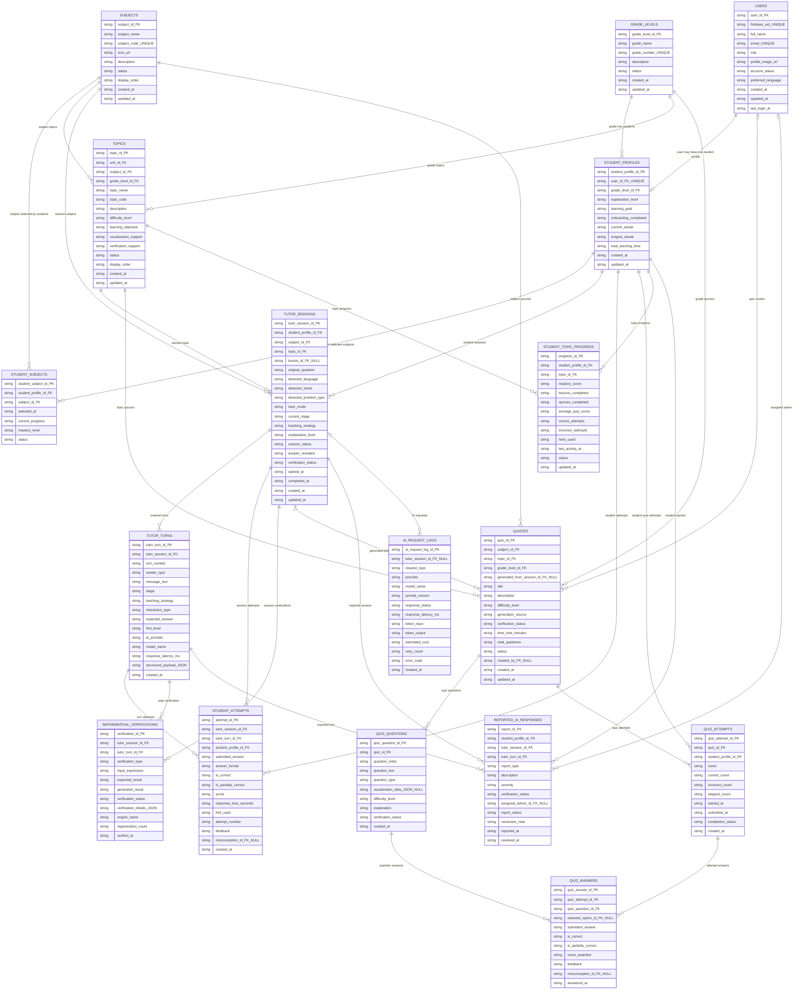

# Rean AI Visual Tutor ERD

Scope: Student and Administrator MVP for Flutter mobile, admin dashboard, Express backend, Firebase Authentication, application data store, FastAPI AI service, visual tutor, voice tutor, quiz generation, SymPy verification, and basic TRACE-CAG response reuse.

## Simplified MVP ERD Mermaid

## Complete Logical ERD Mermaid

```mermaid
erDiagram
  USERS {
    string user_id_PK
    string firebase_uid_UNIQUE
    string full_name
    string email_UNIQUE
    string role
    string profile_image_url
    string account_status
    string preferred_language
    string created_at
    string updated_at
    string last_login_at
  }
  STUDENT_PROFILES {
    string student_profile_id_PK
    string user_id_FK_UNIQUE
    string grade_level_id_FK
    string explanation_level
    string learning_goal
    string onboarding_completed
    string current_streak
    string longest_streak
    string total_learning_time
    string created_at
    string updated_at
  }
  GRADE_LEVELS {
    string grade_level_id_PK
    string grade_name
    string grade_number_UNIQUE
    string description
    string status
    string created_at
    string updated_at
  }
  SUBJECTS {
    string subject_id_PK
    string subject_name
    string subject_code_UNIQUE
    string icon_url
    string description
    string status
    string display_order
    string created_at
    string updated_at
  }
  STUDENT_SUBJECTS {
    string student_subject_id_PK
    string student_profile_id_FK
    string subject_id_FK
    string selected_at
    string current_progress
    string mastery_level
    string status
  }
  CURRICULUM_UNITS {
    string unit_id_PK
    string subject_id_FK
    string grade_level_id_FK
    string unit_name
    string description
    string display_order
    string status
    string created_at
    string updated_at
  }
  TOPICS {
    string topic_id_PK
    string unit_id_FK
    string subject_id_FK
    string grade_level_id_FK
    string topic_name
    string topic_code
    string description
    string difficulty_level
    string learning_objective
    string visualization_support
    string verification_support
    string status
    string display_order
    string created_at
    string updated_at
  }
  TOPIC_PREREQUISITES {
    string prerequisite_id_PK
    string topic_id_FK
    string prerequisite_topic_id_FK
    string relationship_type
    string created_at
  }
  LESSONS {
    string lesson_id_PK
    string topic_id_FK
    string title
    string summary
    string content_reference
    string estimated_duration
    string difficulty_level
    string status
    string created_by_FK
    string created_at
    string updated_at
  }
  TUTOR_SESSIONS {
    string tutor_session_id_PK
    string student_profile_id_FK
    string subject_id_FK
    string topic_id_FK
    string lesson_id_FK_NULL
    string original_question
    string detected_language
    string detected_intent
    string detected_problem_type
    string tutor_mode
    string current_stage
    string teaching_strategy
    string explanation_level
    string session_status
    string answer_revealed
    string verification_status
    string started_at
    string completed_at
    string created_at
    string updated_at
  }
  TUTOR_TURNS {
    string tutor_turn_id_PK
    string tutor_session_id_FK
    string turn_number
    string sender_type
    string message_text
    string stage
    string teaching_strategy
    string interaction_type
    string expected_answer
    string hint_level
    string ai_provider
    string model_name
    string response_latency_ms
    string structured_payload_JSON
    string created_at
  }
  VISUALIZATIONS {
    string visualization_id_PK
    string tutor_turn_id_FK_UNIQUE
    string visualization_type
    string visualization_data_JSON
    string title
    string description
    string render_version
    string validation_status
    string created_at
  }
  STUDENT_ATTEMPTS {
    string attempt_id_PK
    string tutor_session_id_FK
    string tutor_turn_id_FK
    string student_profile_id_FK
    string submitted_answer
    string answer_format
    string is_correct
    string is_partially_correct
    string score
    string response_time_seconds
    string hint_used
    string attempt_number
    string feedback
    string misconception_id_FK_NULL
    string created_at
  }
  HINT_USAGES {
    string hint_usage_id_PK
    string tutor_session_id_FK
    string tutor_turn_id_FK
    string student_profile_id_FK
    string hint_level
    string hint_type
    string hint_content
    string requested_at
  }
  MATHEMATICAL_VERIFICATIONS {
    string verification_id_PK
    string tutor_session_id_FK
    string tutor_turn_id_FK
    string verification_type
    string input_expression
    string expected_result
    string generated_result
    string verification_status
    string verification_details_JSON
    string engine_name
    string regeneration_count
    string verified_at
  }
  MISCONCEPTIONS {
    string misconception_id_PK
    string topic_id_FK
    string misconception_code
    string misconception_name
    string description
    string recommended_strategy
    string status
    string created_at
    string updated_at
  }
  STUDENT_MISCONCEPTIONS {
    string student_misconception_id_PK
    string student_profile_id_FK
    string misconception_id_FK
    string tutor_session_id_FK_NULL
    string detection_count
    string confidence_score
    string first_detected_at
    string last_detected_at
    string resolved_at
    string status
  }
  QUIZZES {
    string quiz_id_PK
    string subject_id_FK
    string topic_id_FK
    string grade_level_id_FK
    string generated_from_session_id_FK_NULL
    string title
    string description
    string difficulty_level
    string generation_source
    string verification_status
    string time_limit_minutes
    string total_questions
    string status
    string created_by_FK_NULL
    string created_at
    string updated_at
  }
  QUIZ_QUESTIONS {
    string quiz_question_id_PK
    string quiz_id_FK
    string question_order
    string question_text
    string question_type
    string visualization_data_JSON_NULL
    string difficulty_level
    string explanation
    string verification_status
    string created_at
  }
  QUIZ_OPTIONS {
    string quiz_option_id_PK
    string quiz_question_id_FK
    string option_label
    string option_text
    string is_correct
    string display_order
  }
  QUIZ_ATTEMPTS {
    string quiz_attempt_id_PK
    string quiz_id_FK
    string student_profile_id_FK
    string score
    string correct_count
    string incorrect_count
    string skipped_count
    string started_at
    string submitted_at
    string completion_status
    string created_at
  }
  QUIZ_ANSWERS {
    string quiz_answer_id_PK
    string quiz_attempt_id_FK
    string quiz_question_id_FK
    string selected_option_id_FK_NULL
    string submitted_answer
    string is_correct
    string is_partially_correct
    string score_awarded
    string feedback
    string misconception_id_FK_NULL
    string answered_at
  }
  STUDENT_TOPIC_PROGRESS {
    string progress_id_PK
    string student_profile_id_FK
    string topic_id_FK
    string mastery_score
    string lessons_completed
    string quizzes_completed
    string average_quiz_score
    string correct_attempts
    string incorrect_attempts
    string hints_used
    string last_activity_at
    string status
    string updated_at
  }
  LEARNING_ACTIVITIES {
    string activity_id_PK
    string student_profile_id_FK
    string activity_type
    string subject_id_FK_NULL
    string topic_id_FK_NULL
    string tutor_session_id_FK_NULL
    string quiz_attempt_id_FK_NULL
    string title
    string duration_seconds
    string completion_status
    string activity_at
  }
  STUDY_STREAKS {
    string streak_id_PK
    string student_profile_id_FK
    string activity_date
    string study_minutes
    string activity_count
    string streak_qualified
    string created_at
  }
  VOICE_SESSIONS {
    string voice_session_id_PK
    string student_profile_id_FK
    string tutor_session_id_FK_NULL
    string language
    string session_status
    string started_at
    string ended_at
    string created_at
  }
  VOICE_INTERACTIONS {
    string voice_interaction_id_PK
    string voice_session_id_FK
    string audio_input_url
    string transcript_text
    string confidence_score
    string ai_response_text
    string audio_response_url
    string processing_status
    string processing_time_ms
    string created_at
  }
  NOTIFICATION_PREFERENCES {
    string preference_id_PK
    string user_id_FK_UNIQUE
    string study_reminder_enabled
    string streak_reminder_enabled
    string announcement_enabled
    string reminder_time
    string timezone
    string updated_at
  }
  DEVICE_TOKENS {
    string device_token_id_PK
    string user_id_FK
    string token_UNIQUE
    string platform
    string device_name
    string is_active
    string last_used_at
    string created_at
  }
  NOTIFICATIONS {
    string notification_id_PK
    string title
    string message
    string notification_type
    string target_grade_id_FK_NULL
    string target_subject_id_FK_NULL
    string scheduled_at
    string sent_at
    string status
    string created_by_FK
    string created_at
  }
  NOTIFICATION_DELIVERIES {
    string delivery_id_PK
    string notification_id_FK
    string user_id_FK
    string device_token_id_FK_NULL
    string delivery_status
    string provider_response_JSON
    string delivered_at
    string opened_at
  }
  REPORTED_AI_RESPONSES {
    string report_id_PK
    string student_profile_id_FK
    string tutor_session_id_FK
    string tutor_turn_id_FK
    string report_type
    string description
    string severity
    string verification_status
    string assigned_admin_id_FK_NULL
    string report_status
    string resolution_note
    string reported_at
    string resolved_at
  }
  AI_REQUEST_LOGS {
    string ai_request_log_id_PK
    string tutor_session_id_FK_NULL
    string request_type
    string provider
    string model_name
    string prompt_version
    string response_status
    string response_latency_ms
    string token_input
    string token_output
    string estimated_cost
    string retry_count
    string error_code
    string created_at
  }
  AI_ERROR_LOGS {
    string ai_error_log_id_PK
    string ai_request_log_id_FK
    string service_name
    string error_type
    string error_message
    string severity
    string retry_status
    string resolved_status
    string created_at
    string resolved_at
  }
  TUTOR_RESPONSE_CACHE {
    string cache_id_PK
    string query_fingerprint_UNIQUE
    string normalized_query
    string subject_id_FK
    string topic_id_FK
    string grade_level_id_FK
    string problem_type
    string explanation_level
    string structured_response_JSON
    string verification_status
    string response_version
    string usage_count
    string created_at
    string expires_at
    string last_used_at
  }
  CACHE_REUSE_LOGS {
    string reuse_log_id_PK
    string cache_id_FK_NULL
    string tutor_session_id_FK
    string reuse_type
    string compatibility_status
    string rejection_reason
    string latency_saved_ms
    string created_at
  }
  AUDIT_LOGS {
    string audit_log_id_PK
    string admin_user_id_FK
    string action_type
    string module
    string target_entity_type
    string target_entity_id
    string previous_data_JSON
    string new_data_JSON
    string ip_address
    string device_info
    string action_result
    string created_at
  }
  SYSTEM_SETTINGS {
    string setting_id_PK
    string setting_group
    string setting_key
    string setting_value
    string value_type
    string is_sensitive
    string updated_by_FK
    string updated_at
  }
  USERS ||--o| STUDENT_PROFILES : "user may have one student profile"
  GRADE_LEVELS ||--o{ STUDENT_PROFILES : "grade has students"
  STUDENT_PROFILES ||--o{ STUDENT_SUBJECTS : "student selected subjects"
  SUBJECTS ||--o{ STUDENT_SUBJECTS : "subject selected by students"
  SUBJECTS ||--o{ CURRICULUM_UNITS : "subject units"
  GRADE_LEVELS ||--o{ CURRICULUM_UNITS : "grade units"
  CURRICULUM_UNITS ||--o{ TOPICS : "unit topics"
  SUBJECTS ||--o{ TOPICS : "subject topics"
  GRADE_LEVELS ||--o{ TOPICS : "grade topics"
  TOPICS ||--o{ TOPIC_PREREQUISITES : "topic prerequisites"
  TOPICS ||--o{ LESSONS : "topic lessons"
  USERS ||--o{ LESSONS : "admin authored lessons"
  STUDENT_PROFILES ||--o{ TUTOR_SESSIONS : "student sessions"
  SUBJECTS ||--o{ TUTOR_SESSIONS : "session subject"
  TOPICS ||--o{ TUTOR_SESSIONS : "session topic"
  LESSONS |o--o{ TUTOR_SESSIONS : "optional lesson grounding"
  TUTOR_SESSIONS ||--o{ TUTOR_TURNS : "ordered turns"
  TUTOR_TURNS ||--o| VISUALIZATIONS : "turn visualization"
  TUTOR_SESSIONS ||--o{ STUDENT_ATTEMPTS : "session attempts"
  TUTOR_TURNS ||--o{ STUDENT_ATTEMPTS : "turn attempts"
  STUDENT_PROFILES ||--o{ STUDENT_ATTEMPTS : "student attempts"
  MISCONCEPTIONS |o--o{ STUDENT_ATTEMPTS : "attempt misconception"
  TUTOR_SESSIONS ||--o{ HINT_USAGES : "session hints"
  TUTOR_TURNS ||--o{ HINT_USAGES : "turn hints"
  STUDENT_PROFILES ||--o{ HINT_USAGES : "student hints"
  TUTOR_SESSIONS ||--o{ MATHEMATICAL_VERIFICATIONS : "session verifications"
  TUTOR_TURNS ||--o{ MATHEMATICAL_VERIFICATIONS : "step verification"
  TOPICS ||--o{ MISCONCEPTIONS : "topic misconception catalog"
  STUDENT_PROFILES ||--o{ STUDENT_MISCONCEPTIONS : "student misconceptions"
  MISCONCEPTIONS ||--o{ STUDENT_MISCONCEPTIONS : "detected misconception"
  TUTOR_SESSIONS |o--o{ STUDENT_MISCONCEPTIONS : "detection source"
  SUBJECTS ||--o{ QUIZZES : "subject quizzes"
  TOPICS ||--o{ QUIZZES : "topic quizzes"
  GRADE_LEVELS ||--o{ QUIZZES : "grade quizzes"
  TUTOR_SESSIONS |o--o{ QUIZZES : "generated follow-up"
  USERS |o--o{ QUIZZES : "quiz creator"
  QUIZZES ||--o{ QUIZ_QUESTIONS : "quiz questions"
  QUIZ_QUESTIONS ||--o{ QUIZ_OPTIONS : "question options"
  QUIZZES ||--o{ QUIZ_ATTEMPTS : "quiz attempts"
  STUDENT_PROFILES ||--o{ QUIZ_ATTEMPTS : "student quiz attempts"
  QUIZ_ATTEMPTS ||--o{ QUIZ_ANSWERS : "attempt answers"
  QUIZ_QUESTIONS ||--o{ QUIZ_ANSWERS : "question answers"
  QUIZ_OPTIONS |o--o{ QUIZ_ANSWERS : "selected option"
  MISCONCEPTIONS |o--o{ QUIZ_ANSWERS : "answer misconception"
  STUDENT_PROFILES ||--o{ STUDENT_TOPIC_PROGRESS : "topic progress"
  TOPICS ||--o{ STUDENT_TOPIC_PROGRESS : "topic progress"
  STUDENT_PROFILES ||--o{ LEARNING_ACTIVITIES : "activity stream"
  STUDENT_PROFILES ||--o{ STUDY_STREAKS : "daily streaks"
  STUDENT_PROFILES ||--o{ VOICE_SESSIONS : "voice sessions"
  TUTOR_SESSIONS |o--o{ VOICE_SESSIONS : "linked voice mode"
  VOICE_SESSIONS ||--o{ VOICE_INTERACTIONS : "voice turns"
  USERS ||--o| NOTIFICATION_PREFERENCES : "preferences"
  USERS ||--o{ DEVICE_TOKENS : "devices"
  USERS ||--o{ NOTIFICATIONS : "admin created notifications"
  NOTIFICATIONS ||--o{ NOTIFICATION_DELIVERIES : "deliveries"
  USERS ||--o{ NOTIFICATION_DELIVERIES : "user delivery"
  DEVICE_TOKENS |o--o{ NOTIFICATION_DELIVERIES : "device delivery"
  STUDENT_PROFILES ||--o{ REPORTED_AI_RESPONSES : "student reports"
  TUTOR_SESSIONS ||--o{ REPORTED_AI_RESPONSES : "reported session"
  TUTOR_TURNS ||--o{ REPORTED_AI_RESPONSES : "reported turn"
  USERS |o--o{ REPORTED_AI_RESPONSES : "assigned admin"
  TUTOR_SESSIONS |o--o{ AI_REQUEST_LOGS : "AI requests"
  AI_REQUEST_LOGS ||--o{ AI_ERROR_LOGS : "AI errors"
  SUBJECTS ||--o{ TUTOR_RESPONSE_CACHE : "cache subject"
  TOPICS ||--o{ TUTOR_RESPONSE_CACHE : "cache topic"
  GRADE_LEVELS ||--o{ TUTOR_RESPONSE_CACHE : "cache grade"
  TUTOR_RESPONSE_CACHE |o--o{ CACHE_REUSE_LOGS : "reuse logs"
  TUTOR_SESSIONS ||--o{ CACHE_REUSE_LOGS : "session cache decisions"
  USERS ||--o{ AUDIT_LOGS : "admin actions"
  USERS ||--o{ SYSTEM_SETTINGS : "setting updater"
```

## Entity Descriptions

- **users**: Firebase-linked identity and role record for students and administrators.

- **student_profiles**: Student learning configuration, grade, onboarding, streak, and learning-time summary.

- **grade_levels**: Supported MVP grades such as Grade 10, Grade 11, and Grade 12.

- **subjects**: Subject catalog for Mathematics, Physics, English, and future active subjects.

- **student_subjects**: Junction table for student subject selection and subject-level mastery.

- **curriculum_units**: Grade-subject curriculum grouping for ordered topics.

- **topics**: Atomic curriculum concept used by lessons, tutor sessions, quizzes, progress, and misconceptions.

- **topic_prerequisites**: Self-referencing topic dependency table.

- **lessons**: Structured lesson or content reference used to ground Visual Tutor answers.

- **tutor_sessions**: Student Visual Tutor problem-solving session and its detected intent/state.

- **tutor_turns**: Ordered student, AI, and system messages within a tutor session.

- **visualizations**: Validated JSON visualization payload attached to a tutor turn.

- **student_attempts**: Student answer attempts for tutor turns, including score and misconception detection.

- **hint_usages**: Hint requests by level, preserving tutor scaffolding behavior.

- **mathematical_verifications**: SymPy or equivalent verification results tied to exact tutor turns.

- **misconceptions**: Topic-specific misconception taxonomy.

- **student_misconceptions**: Student-misconception history and resolution status.

- **quizzes**: Manual or AI-generated quizzes scoped to subject, grade, topic, and optional session.

- **quiz_questions**: Ordered quiz questions with optional visualization JSON.

- **quiz_options**: Multiple-choice options for quiz questions.

- **quiz_attempts**: Student quiz submissions and aggregate scoring.

- **quiz_answers**: Per-question answers, feedback, and misconception detection.

- **student_topic_progress**: One active mastery summary per student-topic pair.

- **learning_activities**: Unified activity stream for sessions, lessons, quizzes, voice, and practice.

- **study_streaks**: Daily study streak qualification records.

- **voice_sessions**: Voice Tutor session linked optionally to a Visual Tutor session.

- **voice_interactions**: STT transcript, AI response, optional TTS URL, and processing status.

- **notification_preferences**: User-level push notification settings.

- **device_tokens**: Firebase Cloud Messaging or equivalent device tokens.

- **notifications**: Admin-created or scheduled notification campaign.

- **notification_deliveries**: Per-user/per-device delivery and open state.

- **reported_ai_responses**: Student quality reports assigned to administrators.

- **ai_request_logs**: Operational AI provider request metadata; avoid raw sensitive prompts.

- **ai_error_logs**: Error diagnostics linked to AI requests.

- **tutor_response_cache**: TRACE-CAG response cache keyed by normalized query/context fingerprint.

- **cache_reuse_logs**: Cache decision, reuse type, compatibility, and latency savings.

- **audit_logs**: Administrative action history.

- **system_settings**: Runtime settings; sensitive values should use secrets/encryption.

## Primary And Foreign Keys

Primary keys are the `*_id` fields marked `PK`. Foreign keys are fields marked `FK` and are explicitly represented in the DBML `Ref` section. Important unique keys: `users.firebase_uid`, `users.email`, `student_profiles.user_id`, `subjects.subject_code`, `grade_levels.grade_number`, `device_tokens.token`, `tutor_response_cache.query_fingerprint`.

## Cardinalities And Junction Tables

One-to-one: `users` to `student_profiles`, `users` to `notification_preferences`, `tutor_turns` to `visualizations`.

One-to-many: grade to students, subject/grade/unit to topics, student to tutor sessions, session to turns, quiz to questions, quiz attempt to answers, user to device tokens, notification to deliveries.

Many-to-many through junctions: students to subjects via `student_subjects`, topics to prerequisite topics via `topic_prerequisites`, students to misconceptions via `student_misconceptions`.

Optional relationships include `tutor_sessions.lesson_id`, `quizzes.generated_from_session_id`, `quiz_answers.selected_option_id`, `reported_ai_responses.assigned_admin_id`, and voice-to-tutor-session links.

## Enum Recommendations

- `user.role`: Student, Administrator.

- `account_status` and content `status`: Active, Inactive, Archived, Deleted.

- `tutor_mode`: Explore Concept, Guided Problem Solving, Check My Work, Revision, Exam Practice.

- `session_status`: Active, Paused, Completed, Abandoned, Failed.

- `sender_type`: Student, AI Tutor, System.

- `verification_status`: Verified, Partially Verified, Failed, Unsupported.

- `quiz.generation_source`: AI Generated, Manual, AI Generated and Admin Reviewed.

- `question_type`: Multiple Choice, Short Answer, Numeric, True or False.

- `activity_type`: Tutor Session, Quiz, Lesson, Voice Session, Practice.

- `report_type`: Incorrect Answer, Unclear Explanation, Broken Visualization, Repeated Response, Inappropriate Content, Unsupported Question, Voice Issue.

- `cache_reuse_logs.reuse_type`: Exact Match, Concept Match, Fresh Generation.

## Data Integrity Constraints

- `users.email` and `users.firebase_uid` must be unique.

- A student profile belongs to exactly one user; enforce `student_profiles.user_id UNIQUE NOT NULL` and `users.role = Student` for student profiles.

- Enforce one active `student_topic_progress` per `(student_profile_id, topic_id)`.

- Enforce `UNIQUE(tutor_session_id, turn_number)` on tutor turns and `UNIQUE(quiz_id, question_order)` on quiz questions.

- Enforce `UNIQUE(student_profile_id, subject_id)` on `student_subjects` and `UNIQUE(topic_id, prerequisite_topic_id)` on `topic_prerequisites`.

- Quiz answers must belong to a question in the same quiz as the parent quiz attempt; enforce in application logic or with a composite FK in relational databases.

- Verified tutor responses must reference only `mathematical_verifications.verification_status = Verified` when reused or marked final.

- Cache entries are reusable only when `tutor_response_cache.verification_status = Verified` and `expires_at > now()`.

- Prefer controlled enum values or lookup checks for roles, statuses, modes, question types, activity types, and report types.

## Deletion And Retention Rules

- Prefer soft deletion for users, curriculum, lessons, quizzes, and reports via `status` or `account_status`.

- Restrict hard delete of grade, subject, unit, topic, and lesson rows when sessions, progress, quizzes, or reports reference them.

- Cascade delete session-scoped rows (`tutor_turns`, `student_attempts`, `hint_usages`, `mathematical_verifications`, `cache_reuse_logs`) only for test data or explicit privacy deletion workflows.

- Keep `audit_logs`, `ai_request_logs`, and `ai_error_logs` append-only with retention windows; redact or hash sensitive prompt/user content.

- Voice audio URLs should be temporary. Store transcripts and metadata only when needed; delete raw audio after processing or after the configured retention period.

- Device tokens can be hard-deleted when revoked or invalid; notification delivery history can be retained as operational logs.

## Firestore Collection Mapping

- Top-level collections: `users`, `student_profiles`, `grades`, `subjects`, `units`, `topics`, `lessons`, `tutor_sessions`, `quizzes`, `quiz_attempts`, `student_progress`, `misconceptions`, `notifications`, `reported_ai_responses`, `ai_request_logs`, `tutor_response_cache`, `audit_logs`, `system_settings`.

- Recommended subcollections: `tutor_sessions/{sessionId}/turns`, `tutor_sessions/{sessionId}/attempts`, `tutor_sessions/{sessionId}/hints`, `tutor_sessions/{sessionId}/verifications`, `tutor_sessions/{sessionId}/cache_reuse_logs`, `quizzes/{quizId}/questions`, `quizzes/{quizId}/questions/{questionId}/options`, `quiz_attempts/{attemptId}/answers`, `voice_sessions/{voiceSessionId}/interactions`, `notifications/{notificationId}/deliveries`.

- Embedded fields: compact denormalized display snapshots such as subject name/code, grade name, topic name, quiz totals, latest mastery score, latest misconception summary, and notification target labels.

- Reference fields: store IDs such as `student_profile_id`, `subject_id`, `topic_id`, `grade_level_id`, `tutor_session_id`, and `quiz_id`; avoid relying on Firestore document references for portable service integration.

- Denormalized summaries: keep `student_profiles.current_streak`, `student_profiles.total_learning_time`, `student_subjects.current_progress`, `student_topic_progress.mastery_score`, `quizzes.total_questions`, and session `verification_status` updated by backend transactions or idempotent jobs.

## Suggested Firestore Composite Indexes

- `student_profiles`: `(user_id)`, `(grade_level_id, account_status)` if status is copied from user.

- `student_subjects`: `(student_profile_id, status)`, `(subject_id, status)`.

- `units`: `(subject_id, grade_level_id, status, display_order)`.

- `topics`: `(subject_id, grade_level_id, status, display_order)`, `(unit_id, status, display_order)`.

- `lessons`: `(topic_id, status, difficulty_level)`.

- `tutor_sessions`: `(student_profile_id, session_status, updated_at desc)`, `(subject_id, topic_id, created_at desc)`, `(verification_status, created_at desc)`.

- `tutor_sessions/{sessionId}/turns`: `(turn_number)`, `(sender_type, created_at)`.

- `tutor_sessions/{sessionId}/attempts`: `(student_profile_id, tutor_turn_id, attempt_number)`, `(misconception_id, created_at desc)`.

- `quiz_attempts`: `(student_profile_id, submitted_at desc)`, `(quiz_id, score desc)`.

- `student_progress`: `(student_profile_id, status, last_activity_at desc)`, `(topic_id, mastery_score)`.

- `reported_ai_responses`: `(report_status, severity, reported_at desc)`, `(assigned_admin_id, report_status, reported_at desc)`.

- `ai_request_logs`: `(tutor_session_id, created_at desc)`, `(provider, model_name, response_status, created_at desc)`.

- `tutor_response_cache`: `(query_fingerprint)`, `(subject_id, topic_id, grade_level_id, problem_type, explanation_level, verification_status, expires_at)`.

## Main Data Flow

A Firebase-authenticated user maps to `users`; student users receive one `student_profiles` row and choose subjects through `student_subjects`. Curriculum is organized by grade, subject, unit, topic, and lesson. A Visual Tutor interaction creates a `tutor_sessions` row, ordered `tutor_turns`, optional `visualizations`, `student_attempts`, hints, and SymPy verification rows. Tutor and quiz outcomes update `student_topic_progress`, `learning_activities`, streaks, and misconceptions. AI provider metadata goes to request/error logs, verified reusable responses go through `tutor_response_cache`, and student reports enter the admin review workflow.
